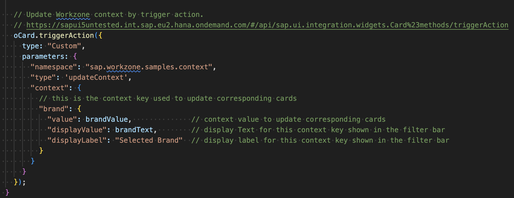
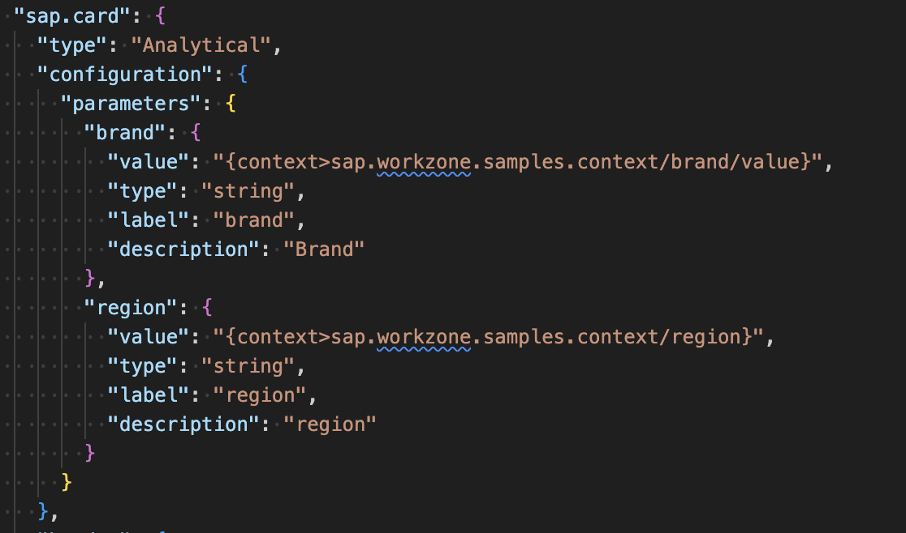
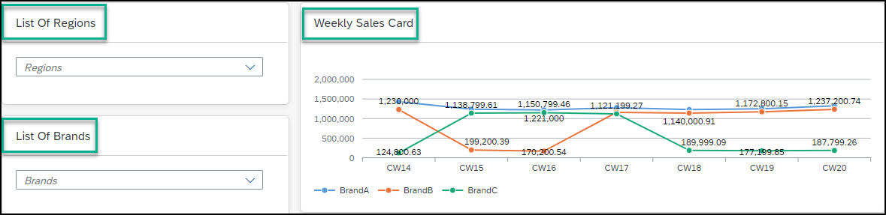
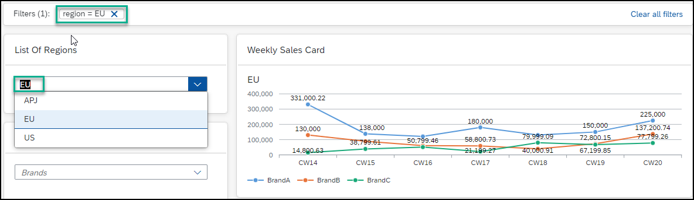
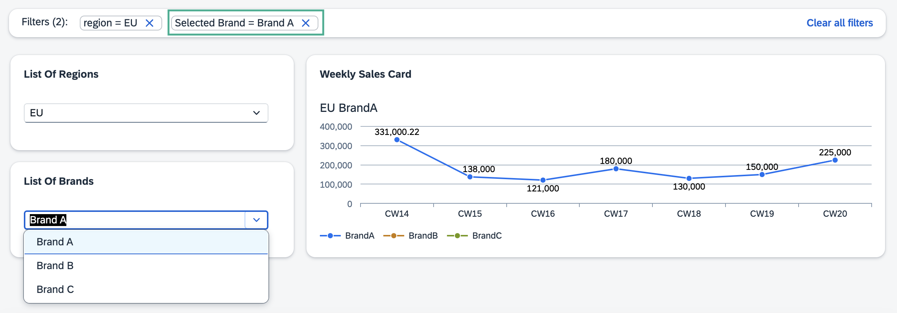

# Interaction Between Cards in the SAP Build Work Zone

Cards on the same workpage can interact by setting and getting parameters from the card context. All parameters in the card context are made available to a card when it is initialized, allowing the card to respond to recognized parameters. When a card updates a parameter in the card context, all other cards on the same page are refreshed to receive the updated context parameter.

## Explorer Sample Codes

Sample code for various cards can be found in the [sample-cards](./sample-cards/README.md) directory. Follow the README file to start the card in a local environment:

- [Work Zone Brand Card](./sample-cards/brand-list-card/)
  - Lists all available brands in a dropdown list. Once a brand is selected, it is added to the current card context as the `brand` parameter.

- [Work Zone Region Card](./sample-cards/region-list-card/)
  - Lists all available regions in a dropdown list. Once a region is selected, it is added to the current card context as the `region` parameter.

- [Work Zone Analytical Card](./sample-cards/analytical-card/)
  - An analytical card that subscribes to the `brand` and `region` card context parameters.
  - The analytical chart automatically refreshes when the `brand` or `region` parameter is updated.

## How to Update Card Context

A card can emit the `updateContext` event with the specified context to update the card context and refresh other cards on the workpage:



### Parameter Type

```ts
{
  namespace: string,                 // Namespace of this context
  context: Record<string, any>       // Context to update; the key is the context key, and the value is the context value
}
```

## How to Subscribe to Card Context

A card can retrieve a card context by explicitly adding a card parameter with `{context>namespace/property/value}`:



## Context Awareness in Workzone

Once you select one of the available card parameters, all other cards designed to respond to the workpage context will update accordingly. Each parameter acts as a filter, visible in the top menu bar, remaining in focus even when you scroll down the workpage. This allows you to always see the filters you've added.

Consider a workpage with the following UI Integration cards: [Brand Card](./sample-cards/brand-list-card/), [Region Card](./sample-cards/region-list-card/), and [Analytical Card](./sample-cards/analytical-card/), all supporting context awareness:



In the `Regions card`, select "EU" as the parameter. This parameter is added as a filter to the bar at the top of the workpage and updates the Weekly Sales Card accordingly.



Now, add another parameter to filter the graph further. In the `Brands card`, select "BrandB". The new filter appears in the bar at the top, and the Weekly Sales Card updates to reflect both filters.


