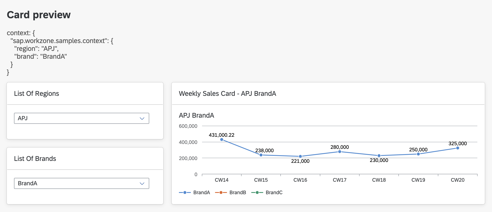

### Getting Started

1. **Install Dependencies:**
   Run the following command to install the necessary packages:
   ```bash
   npm install
   ```

2. **Start Card Preview:**
   To launch the card preview, use the following command:
   ```bash
   npm start
   ```

3. **Generate Card Bundles:**
   To generate card bundles and store them in the `dist` folder, run:
   ```bash
   npm run build:all
   ```

### Navigating Through Different Cards

1. After executing `npm start`, access `http://localhost:8010` to view the cards locally.

2. **Update Card Context:**
   - Select `Regions` or `Brands` from the Cards in left panel
   - Once the Card context is updated, the `Analytical Card` in right panel is automatically refreshed
   - Current context is shown on the top panel

