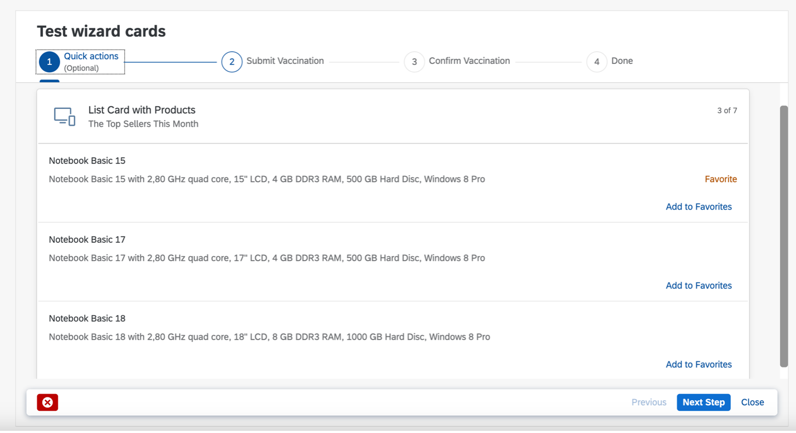
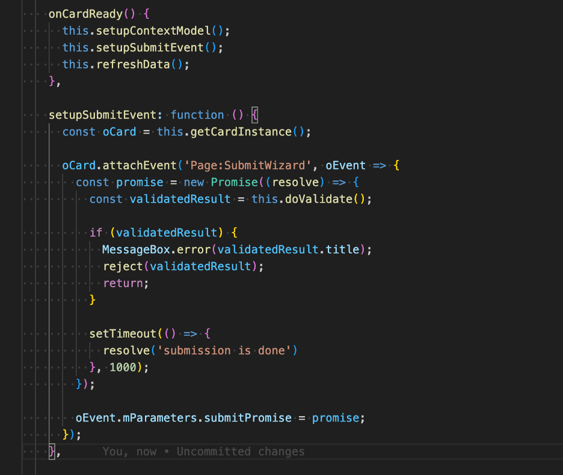
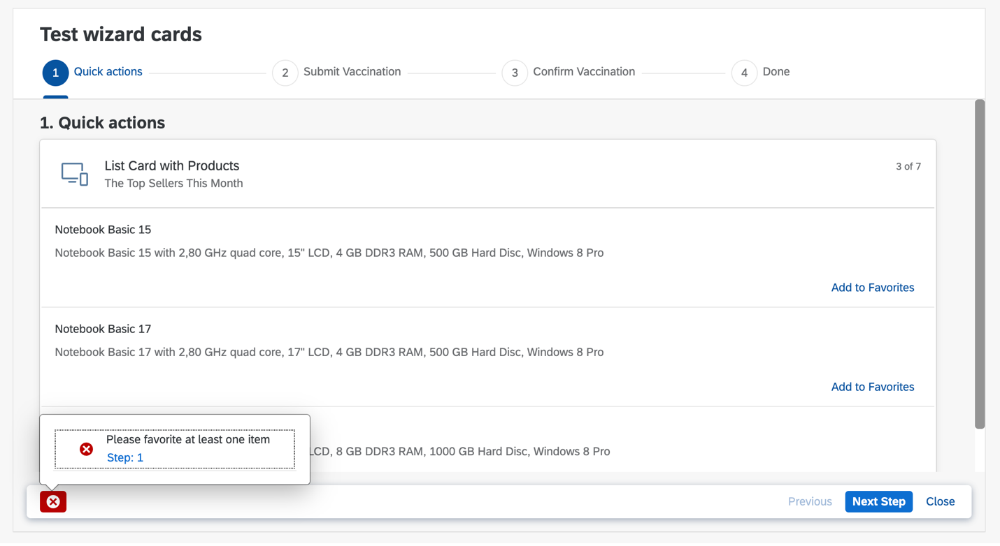
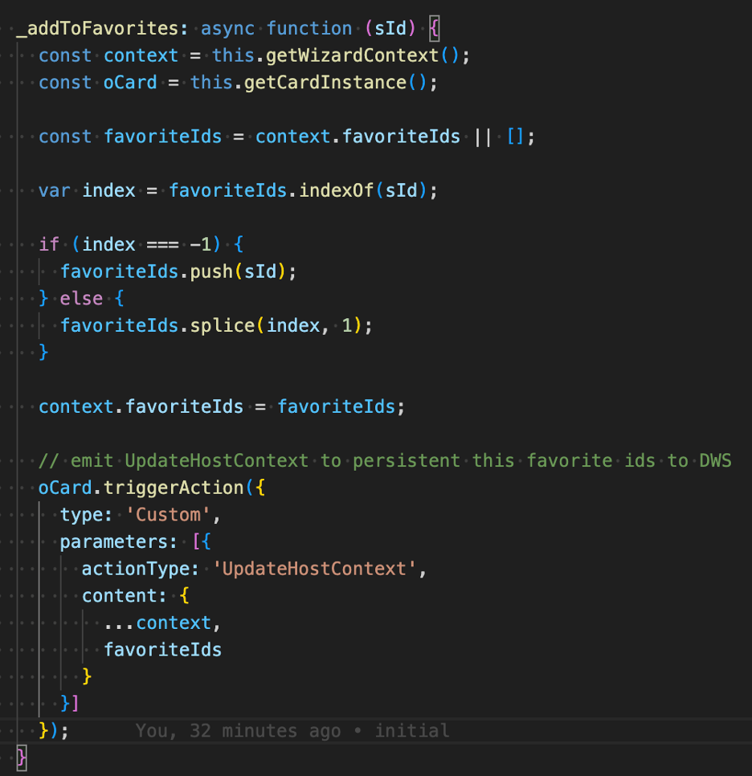
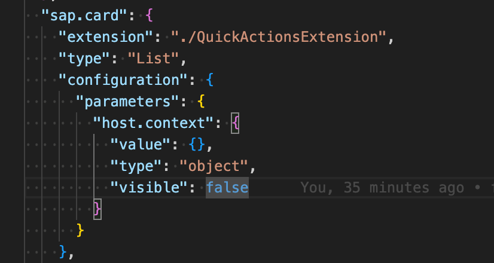
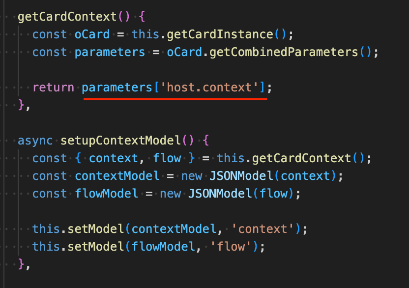
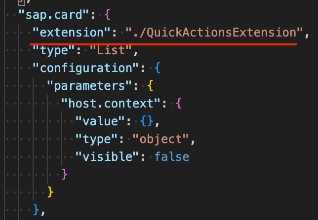
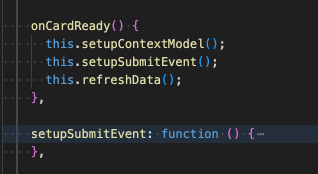

The Workzone Wizard is a tool designed to empower users to create Wizards with customized Steps. Customers can seamlessly integrate DWS native widgets and UI Cards into each Step. The Step is marked as complete once all the widgets and UI Cards within this Step are finalized. Below is a snapshot of a basic Wizard featuring the [Workzone Favorite Card](./sample-cards/wz-favorite-card):

 

## How to subscribe Submission events?

When user clicks the “Next Step” on the footer, `Page:SubmitWizard` event is emitted to the UI Cards. The card can attach this event to perform validation or submit content to server. Sample code as below:

The Card can return `rejected` Promise to notice the Wizard this Card is not completed. The error message will show on the wizard footer.

## How to Persist Card context in to Workzone?

Consider there are 3 cards:
* Basic Card: collects user basic info such as username, gender and so.
* Skillset Card: collects user skillset.
* Submission Card: submit the collected user info from above 2 Cards to back end.

As card developer, we only want to submit the user info to back end to persist in the last Card. But we still want to persist user input for Basic and Skillset Card, so when user resume the Wizard, the input is not lost.

Workzone Wizard providers a layer to persist context from the Cards. The Card could emit event `UpdateHostContext` with context to leverage Workzone to persist temporary Card context:

## How to retrieve persistent Card context?

Card can retrieve the persistent Card context be explicitly declaring `host.context` Card parameter:

Setup the context model in Card Controller/Extension:

## How to support in Declarative Card?

To use above features in declarative Card, we must add an extension for the Card:

## All above event/parameter/model setup must happen on the onCardReady event instead of onInit event:

## Sample Cards in this repository:

Here are sample cards to demonstrate the Wizard interactive events:
* [Workzone Favorite Declarative Card](./sample-cards/wz-favorite-card):
  - Leverage Workzone Wizard to persist the Favorite Item
  - Validate whether user favorites at least one item in Wizard Submission

* [Workzone Vaccination Component Cards](./sample-cards/wz-favorite-card):
  - Vaccination Status Card is to collect Vaccination Status.
  - Vaccination Confirmation Card is to confirm the Vaccination info. Once it is confirmed, user is not able to update Vaccination status anymore.

* [Workzone Vaccination Confirmation Component Cards](./sample-cards/wz-favorite-card):
  - Vaccination Status Card is to collect Vaccination Status.
  - Vaccination Confirmation Card is to confirm the Vaccination info. Once it is confirmed, user is not able to update Vaccination status anymore.
