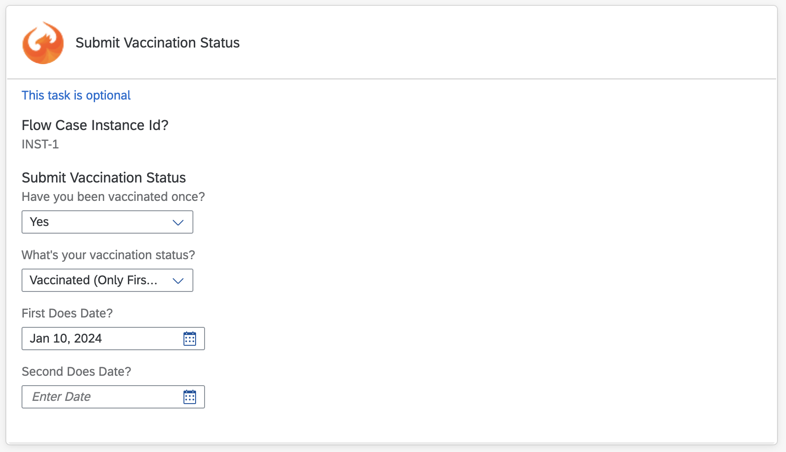

## Work Zone Vaccination Component Cards

- **Vaccination Status Card:**
  - Collects and persists the user's Vaccination Status.

- **Usage of Work Zone Wizard:**
  - Leverages the Work Zone Wizard to manage and persist the Vaccination Status.

- **Inter-Card Context Reading:**
  - Checks whether the user has confirmed their Vaccination in the Vaccination Confirmation Card. This serves as an example of reading context from other cards.

- **Update Restrictions:**
  - Once the Vaccination is confirmed, users are restricted from updating their Vaccination status further.

