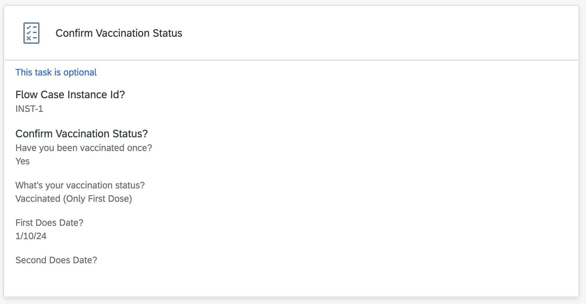

## Work Zone Vaccination Confirmation Component Card
  - Reads the context from the Vaccination Card, and shows it in readonly model.
  - Ask user to confirm the Vaccination Information. Once it is confirmed, the user is not able to update Vaccination Status anymore.

