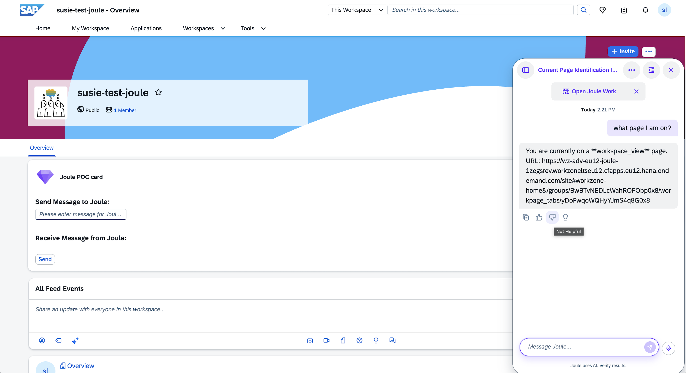
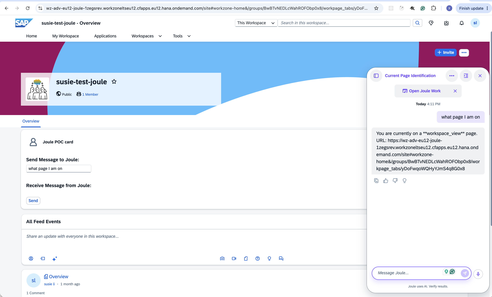

# Workzone Context in Joule Capabilities — Examples

This document demonstrates how to use the **Workzone application context** (`$transient.app_context`) within Joule capability functions, based on the `wz_context_sample_capability`.

---

## Overview

When a user interacts with Joule inside SAP Build Work Zone, the platform provides application context through the `$transient.app_context` variable. This tells the capability where the user currently is.

### Available Context Properties

| Property | Type | Description |
|----------|------|-------------|
| `type` | string | The page type (e.g., `"workspace"`, `"home"`, `"admin"`) |
| `url` | string | The full URL of the current page |

> **Note:** `$transient.app_context` is `null` if the context cannot be retrieved.

---

## Example: Get WorkZone Context

### Scenario

**File:** `scenarios/get_workzone_context.yaml`

```yaml
title: Get WorkZone context
description: |
  Returns the current WorkZone context, including the URL and page type of the page
  the user is currently viewing.
  Sample user queries: "What page am I on?", "What is the current WorkZone context?",
  "Where am I in WorkZone?"

target:
  type: function
  name: get_workzone_context
```

### Function

**File:** `functions/get_workzone_context.yaml`

```yaml
action_groups:
  - condition: "$transient.app_context != null"
    actions:
      - type: message
        scripting_type: spel
        message:
          type: text
          content: "<? new i18n('WORKZONE_CONTEXT_FOUND', $transient.app_context.type, $transient.app_context.url) ?>"

  - condition: "$transient.app_context == null"
    actions:
      - type: message
        message:
          type: text
          content: "{{ i18n 'WORKZONE_CONTEXT_NOT_FOUND' }}"
```

**How it works:**

1. Check if `$transient.app_context` is available (not null).
2. If available, use SpEL (`scripting_type: spel`) to read `type` and `url` and pass them to an i18n message.
3. If unavailable, show a fallback message using Handlebars.

### i18n

**File:** `i18n/messages.properties`

```properties
#XMSG, {0} is the page type, {1} is the URL
WORKZONE_CONTEXT_FOUND=You are currently on a **{0}** page. URL: {1}
#XMSG, fallback when context is unavailable
WORKZONE_CONTEXT_NOT_FOUND=I could not retrieve the current WorkZone context.
```

### Sample Conversation

User asks: "what page I am on?"

Joule responds with the current page type and URL:



---

## Capability Structure

```
wz_context_sample_capability/
├── capability.sapdas.yaml          # Metadata, namespace, system aliases
├── scenarios/
│   └── get_workzone_context.yaml   # Scenario definition
├── functions/
│   └── get_workzone_context.yaml   # Function with action_groups
├── i18n/
│   └── messages.properties         # Localized messages
└── tests/
    ├── features/
    │   └── get_workzone_context.feature
    └── scenarios/
        └── get_workzone_context.yaml
```

### capability.sapdas.yaml

```yaml
schema_version: 3.26.0

metadata:
  namespace: com.sap.dws.joule
  name: workzone_context_capability
  version: 1.0.0
  display_name: WorkZone Context Capability

system_aliases:
  JamService:
    destination: JAM
```

---

## Example: Card Sends Message to Joule (Card Custom Action)

This example shows how a UI Integration Card embedded in Work Zone can send a message to Joule via Card Custom Action. Combined with the Work Zone context capability above, the card can ask Joule "What page am I on?" and Joule will respond with the current page context.

### How to Send a Message to Joule from a Card

Use `triggerAction` with `type: 'Custom'` and `actionType: 'JouleRequest'`:

```javascript
this.getCard().triggerAction({
  type: 'Custom',
  parameters: {
    actionType: 'JouleRequest',
    content: { message: 'What page am I on?' }
  }
});
```

### Card Manifest Configuration

```json
{
  "sap.app": {
    "id": "sap.jam.component.joule",
    "type": "card",
    "title": "Joule POC card"
  },
  "sap.card": {
    "type": "component",
    "header": {
      "title": "Joule POC card"
    }
  }
}
```

### How it works

1. Card calls `triggerAction` with `actionType: 'JouleRequest'` and the message content
2. Work Zone's page builder intercepts the Custom Action
3. Portal creates a new Joule conversation and sends the message
4. Joule processes the message through its capabilities
5. Since Work Zone context is available via `$transient.app_context`, Joule responds with the current page type and URL

### Sample Interaction

Card sends "what page I am on" to Joule, and Joule responds with the current Work Zone context:



This demonstrates both features working together: the Card sends a message to Joule, and Joule uses the Work Zone context to provide a location-aware response.