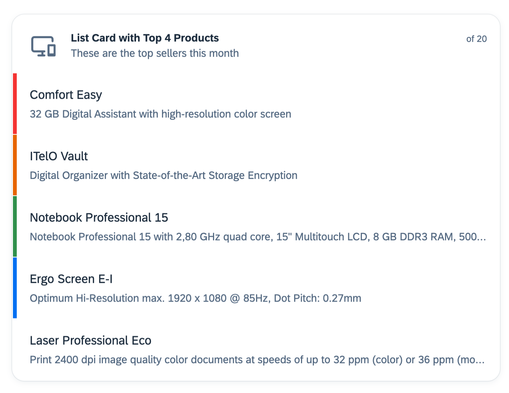
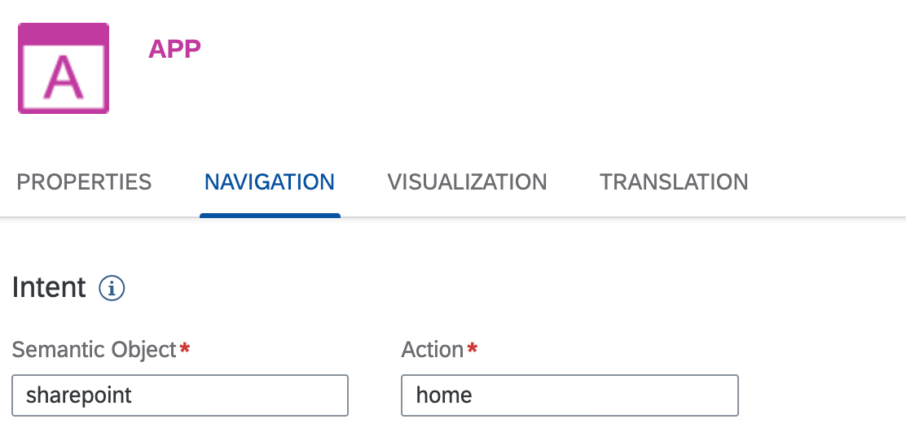
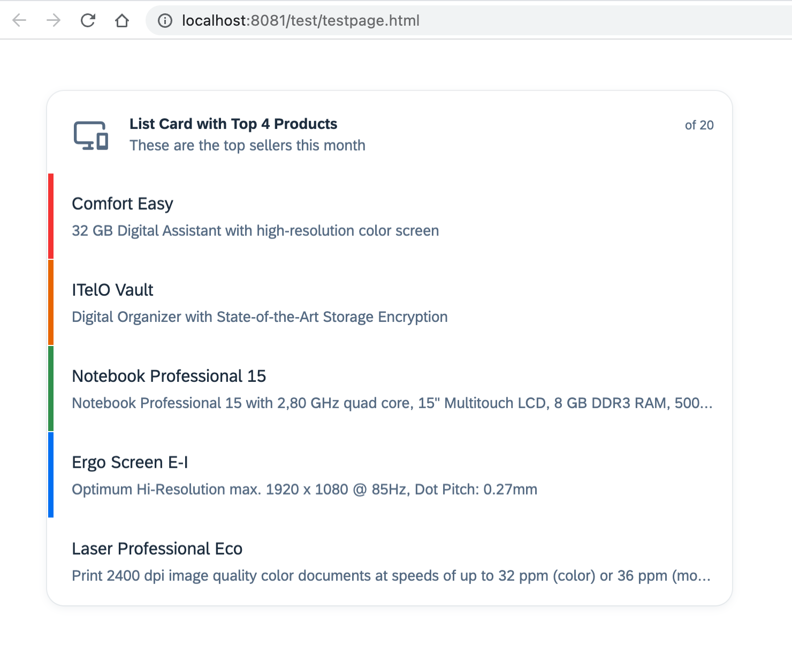
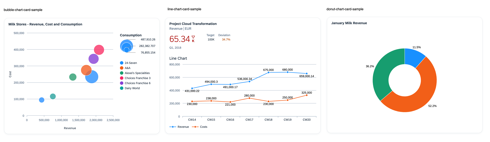
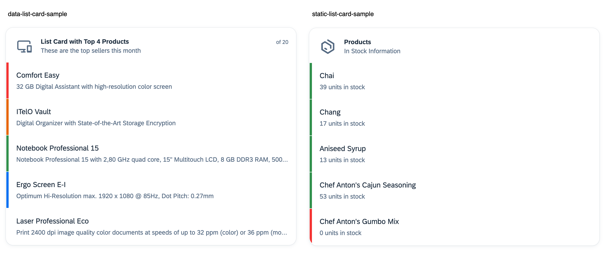
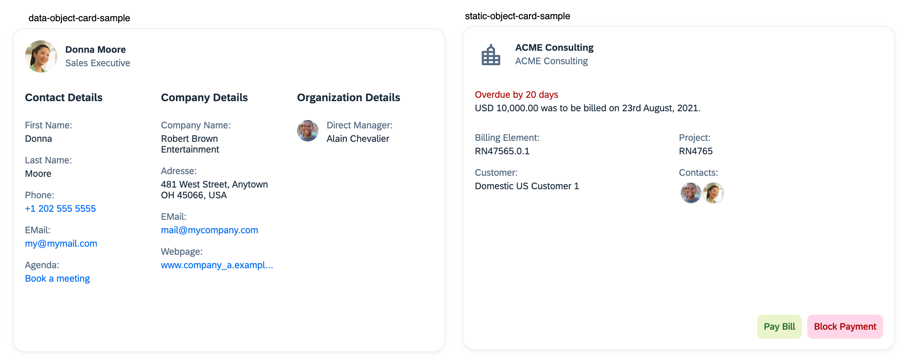

# Defining a UI Integration Card

A UI Integration Card consists of a `manifest.json` file that defines the card's content. A simple card consists only of this definition.

Additionally, the card definition can refer to other resources such as:
- UI resources such as images
- Data with
  - Static data
  - Dynamic data retrieved by a service request
- Java script extensions
- Externalized translation for texts (internationalization - i18n)

For more information around UI Integration Cards please check the card explorer:
https://sapui5.hana.ondemand.com/test-resources/sap/ui/integration/demokit/cardExplorer/webapp/index.html

## Creating a simple card

A very easy example for a List Card can be found here:

If you create your own cards please change the id with your company specific namespace.


https://sapui5.hana.ondemand.com/test-resources/sap/ui/integration/demokit/cardExplorer/webapp/index.html#/explore/list

An enhanced example with externalized translation for texts is available here:
[content-package-customer-sample/card-samples/list-card-samples/static-list-card-sample/src](../../card-samples/list-card-samples/static-list-card-sample/src)



## Intent-Based Navigation to CDM Business Applications
A card can also navigate to applications exposed in your system.

Such an application is configured in the Site Manager.



To trigger a navigation to an application, the card header, instead of a navigation URL, can contain the intent (semantic object, action) and pass parameters of the intent.
With that indirection the card can launch applications independent of a concrete URL. This is especially useful if the URL is a company specific URL that could change over time.
  
  ```` json
    "header": {
			"title": "Sharepoint",
			"actions": [
				{
					"type": "Navigation",
					"parameters": {
						"ibnTarget": {
							"semanticObject": "sharepoint",
							"action": "home"
						}
					}
				}
			]
		},
  ````
  
  Additional documentation can be found here:
  https://sapui5.hana.ondemand.com/test-resources/sap/ui/integration/demokit/cardExplorer/webapp/index.html#/learn/actions/navigation

## Translating a card
The card manifest.json file can contain texts that appear in the UI. 
If relevant for your company you should consider to externalize the texts into a folder `i18n` as shown in this example:
[content-package-customer-sample/card-samples/list-card-samples/static-list-card-sample/i18n](../../card-samples/list-card-samples/static-list-card-sample/src/i18n)

Translatable text keys are referred to with double curly backets.

`title": "{{TEXT_KEY}}"`

Additionally, the manifest.json file needs to point to the i18n folder that contains the `i18_LANGUAGE_REGION.properties` files. 

`"i18n": "i18n/i18n.properties"`


The Card Explorer also includes a sample how to provide translations:
https://sapui5.hana.ondemand.com/test-resources/sap/ui/integration/demokit/cardExplorer/webapp/index.html#/explore/translation

<details>
  <summary>Referring to translations in a manifest.json file</summary>
  
  ```` json
    "sap.app": {
    "id": "my.company.ns.static.list.card", //RESTRICTION: Only 37 chars are allowed
    "type": "card",
    "i18n": "i18n/i18n.properties",
    "title": "{{STATIC_LIST_TITLE}}",
    "subTitle": "{{STATIC_LIST_SUBTITLE}}",
    "applicationVersion": {
      "version": "1.0.0"
    },
    "shortTitle": "{{STATIC_LIST_SHORTTITLE}}",
    "info": "{{STATIC_LIST_INFO}}",
    "description": "{{STATIC_LIST_DESCRIPTION}}",
    "tags": {
      "keywords": [
        "{{STATIC_LIST_KEYWORD1}}",
        "{{STATIC_LIST_KEYWORD2}}",
        "{{STATIC_LIST_KEYWORD4}}",
        "{{STATIC_LIST_KEYWORD4}}"
      ]
    }
  },
  "sap.ui": {
    "technology": "UI5",
    "icons": {
      "icon": "sap-icon://list"
    }
  },
  "sap.card": {
    "type": "List",
    "header": {
      "title": "{{STATIC_LIST_CARDTITLE}}",
      "subTitle": "{{STATIC_LIST_CARDSUBTITLE}}"
   ...
  `````
</details>

## Updating/Versioning of a card

The card manifest.json file contains also version information.
This version should be increased if changes where made to the card. 
If a card is published via a content package this version is relevant.
The card is only updated if the versions of the card and the content package are increased.

Depending on the type of changes it should follow a semantic versioning consisting of 3 numbers 1.0.0 (`major.minor.patch`).
Refer to https://semver.org/#semantic-versioning-specification-semver

Consider 
- Patch version increase for bugfixes
- Minor version increase for compatible enhancements
- Major version increase for incompatible enhancements


````
"applicationVersion": {
  "version": "1.0.0"
}
````


## Test and build the card

The above sample folder contains a List Card that you can test locally. 

**Open a terminal on this subfolder**
[content-package-customer-sample/card-samples/list-card-samples/static-list-card-sample](../../card-samples/list-card-samples/static-list-card-sample)

**Install the necessary tooling (once)**

*Enter the below in the terminal*
````
npm install
````
**Run a local test**

*Enter the below in the terminal*
````
npm start
````

A browser instance will be opened containing this list card.



## Integrate the card into a Content Package
After the card is successfully tested we can add it to the content package as described here:

[Define Content](../content-package/introduction.md#defining-content-contentjson)


## Explore other cards
More card examples that are used within this repository can be found here:

[content-package-customer-sample/card-samples](../../card-samples)

### Analytical Card samples - analytical-card-samples (3 samples)


### List Card samples - list-card-samples (2 samples)


### Object Card samples - object-card-samples (2 samples)



