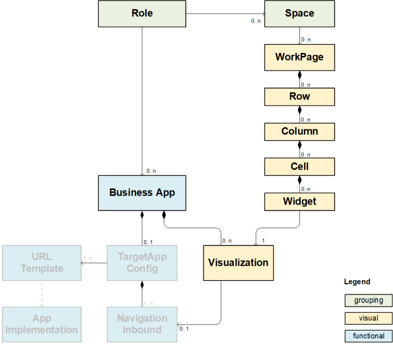

# Common Data Model (CDM)

## Overview

The _Common Data Model_ (CDM) is used to describe the main content entities which are used in SAP Start (Beta) and SAP Launchpad Service New Site Experience (Beta), such as spaces, workPages, and apps. Such CDM content definitions along with further artifacts such as card bundles can be packaged into a [Content Package](../content-package/introduction.md).

This document describes which CDM entity types are supported for content packages and provides corresponding examples and JSON schema definitions. 

## Entity Types

The CDM entity types which can be bundled into a content package and deployed to SAP Start (Beta) and SAP Launchpad Service New Site Experience (Beta) cover:
  - Roles
  - Spaces
  - Workpages
  - Business Apps
  - Catalogs
  - URL-Templates



### Role

A _Role_ groups instances of spaces and business apps. Later on, access to these spaces and business apps can be granted by assigning roles to a set of users. 
**TODO: Link to Launchpad Docu for assigning roles to users**

Technically, a role is defined by an ID, a human readable title and references to spaces and business apps (see example and JSON schema below). 

> [Example](../../cdm-samples/src/role1.json) \
> [JSON Schema](schema/role.json) 

### Space

A _Space_ groups several workpages. The set of all spaces visible to the currently logged on user (through corresponding role assignments) will visually be represented as entries in the shell's top level menu.

Technically, a space is defined by an ID, a human readable title and references to workpages (see example and JSON schema below). 

> [Example](../../cdm-samples/src/space1.json) \
> [JSON Schema](schema/space.json) 

### Workpage

A _WorkPage_ defines the structure and content of a page. Its layout is structured in rows consisting of columns, each of which may have multiple cells holding widgets as the actual content to be displayed. A _Widget_ is a concrete usage of a _Visualization_ on a page and in this sense is an instance of a _Visualization_ (see section _Business App_ below). 

The lifecycle of these layout elements is coupled to the containing workpage instance, i.e. it is not possible to create a row outside of a workpage.

> [Example](../../cdm-samples/src/workpage1.json) \
> [JSON Schema](schema/workpage.json) 

### Business App

The _Business Apps​_ entity combines -- i.e. is a composition of -- two sub-entities:

1) A **_Visualization_**, describing how the app can be visualized on a page. \
   Such visualizations can be of different types such as tiles or cards (as indicated by the `vizType` property). 
2) A **_TargetAppConfig_**, describing how the app is launched from a page or another app. \
   The TargetAppConfig can define multiple _inbounds_ with individual parameters and a reference to a _URL-Template_ which declaratively describes the URL which the app should be launched through.

The current version of the [_Content Package Bundler_](../content-package/introduction.md) generates business app entities automatically for each of the cards which is defined as part of the content package (see [Defining Content](../content-package/introduction.md)). The `id` of the business app is generated by the `id` of the corresponding card with the `.app` suffix appended (e.g. `my.company.ns.bubble.chart.card` => `my.company.ns.bubble.chart.card.app`). This generated `id` has to be used in the references to this app in the role and space entities. 

The definition of other visualization types (e.g. Tiles) as well as an own TargetAppConfig will be covered in future versions of the Content Package Bundler.

> [JSON Schema](schema/businessapp.json) 

### Catalog

A _Catalog_ groups business apps and their visualizations around some business semantics. This grouping is used in the _Content Finder_ when users browse the available app _visualizations_ to place them on a _Workpage_.

Technically, a catalog is defined by an ID, a human readable title and references to business app visualizations (see example and JSON schema below). 

> [Example](../../cdm-samples/src/catalog1.json) \
> [JSON Schema](schema/catalog.json) 


### URL-Template
A _URL-Template_ is composed of a URL pattern, parameters, and additional configurations. Following [RFC 6570 (URI template)](https://www.rfc-editor.org/rfc/rfc6570.txt), it defines how the launch URL of exposed apps should be constructed. A URL template contains parameters that are substituted during URL creation based on navigation parameters, environment variables, and the runtime platform.

> [Example](../../cdm-samples/src/urltemplate1.json) \
> [JSON Schema](schema/urltemplate.json) 

## Translatable Texts

Each of the entity types mentioned above requires the definition of human readable texts which need to be provided in multiple languages.

Within the CDM definitions, placeholders for such translatable texts are maintained using a double curly brackets syntax, e.g. `"title": "{{SPACE_TITLE1}}"`
 
The actual locale specific texts are expected by the Content Package Bundler in the `i18n` subfolder in resource bundle files. For example, the file `i18n_en.properties` containing: 

```
ROLE_TITLE1=Content Package Role 1
ROLE_TITLE2=Content Package Role 2

SPACE_TITLE1=Content Package Space 1

PAGE_TITLE1=Workpage 1
PAGE_TITLE2=Workpage 2
```

## Representation of CDM entities in Package Manifest

During the content package generation, all CDM entities which shall be included into the generated content package need to be defined as part of the `content.json` file (see [Content Package](../content-package/introduction.md), section _Defining Content_). The bundler will then pick up all referred CDM entity definitions and will generate them into the property `cdmEntities` of the package manifest.json file. Additionally, for each processed entity, all texts which are referred to by the doubly curly brackets syntax (e.g. `"title": "{{SPACE_TITLE1}}"`, see section _Translatable Texts_ above) will be read from the resource bundle files in the `i18n` subfolder and will be inlined into a dedicated `texts` property of that entity.  
